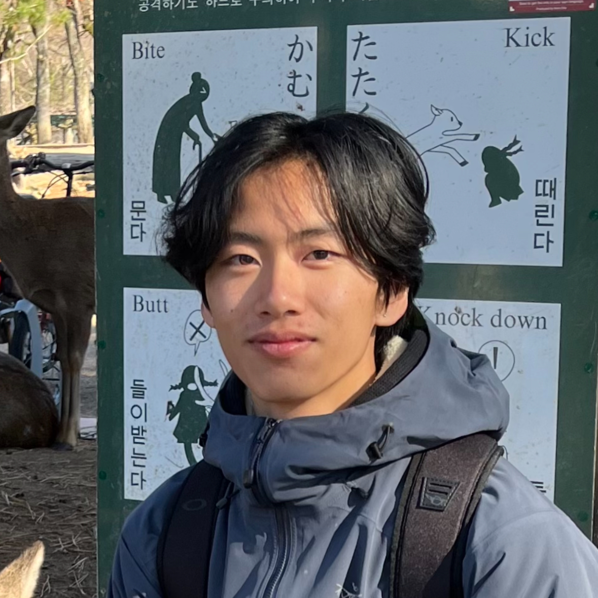

{:style="float: right; padding: 30px; max-width: 30%; min-width: 330px;"}

 
Hi! I'm Andy, an undergrad Researcher and Engineer at [UC Berkeley](https://www.berkeley.edu) studying Electrical Engineering and Computer Science (EECS). 

My research interests lie in building efficient and intelligent AI agents using Reinforcement Learning and interacting with the world through Robotics.
Currently, I'm working on offline-to-online RL at [BAIR](https://bair.berkeley.edu) under the [RAIL](https://rail.eecs.berkeley.edu) group. Outside my research, I enjoy building applied machine learning applications within the wonderful community at [Launchpad](https://launchpad.studentorg.berkeley.edu).

I've spent some time exploring hardware design/validation and FPGA programming with the Energy Infrastructure team at [Tesla](https://www.tesla.com), and learned PCB design and firmware alongside my friends at [Berkeley Formula Racing](https://fsae.studentorg.berkeley.edu). I'll also be working on LLM training and infrastructure at [NVIDIA](https://nvidia.com) this summer.

Outside work, I spend my time painting with my oil paints and colored pencils, playing intramural basketball, and searching for new matcha lattes in the bay!

If you'd like to chat, please reach out at [andypeng at berkeley dot edu].

## Recent News
last updated: Dec 2024
- I just released my first ever research paper with BAIR! We explore how to do RL fine-tuning without offline data retention. I'm excited to see how [Warm-start RL (WSRL)](http://arxiv.org/abs/2412.07762) can help scale up RL for real-world tasks, and the future of efficient RL finetuning.
